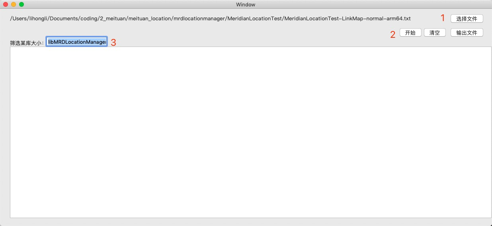

# WMLinkMapAnalyzer
自己写的一个关于xcode linkmap的分析小软件，方便大家跟容易的分析，希望大家多多支持。
使用方法：
第一步，点击选择文件linkmap的路径
第二步，填写需要筛选的库（可选）
第三步，点击开始
第四步，等待一会儿
第五步，可以导出相应的txt文件方便大家分析

在这个基础上稍微改动了一下：
https://github.com/Rick630/LinkMap-Analyze 
